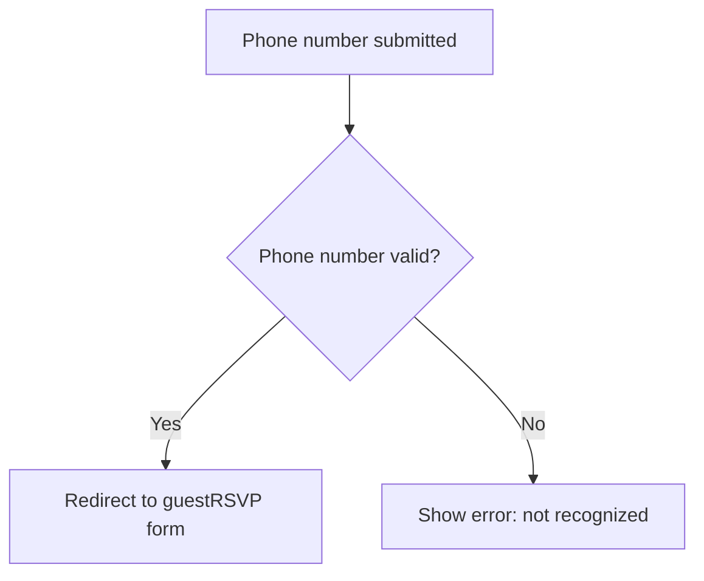
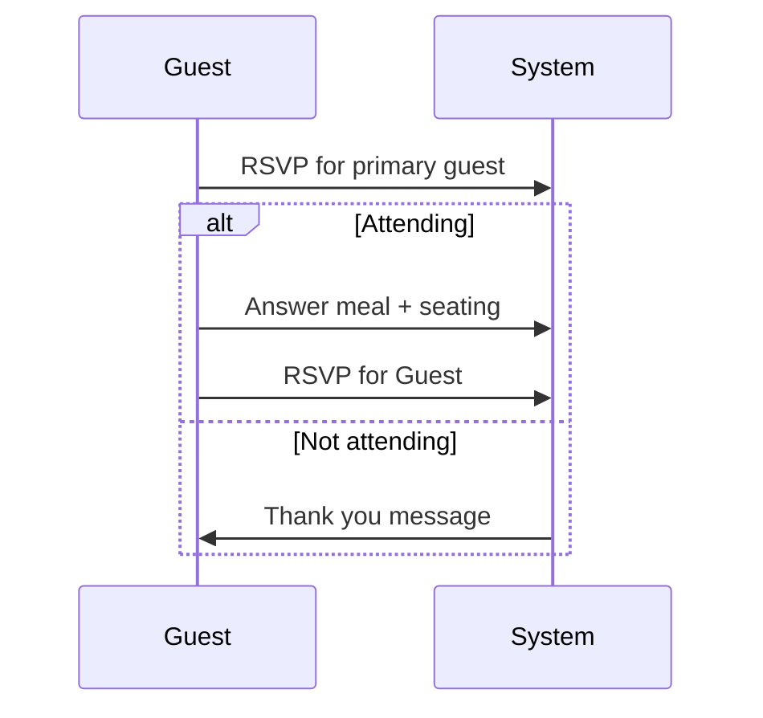

# Wedding RSVP Web App ✨💍

This repository contains the Google Apps Script code and supporting assets for a **wedding RSVP system** designed to provide a personalized RSVP experience for invited guests.

---

## 🌐 Live Demo

The RSVP form is embedded on the couple’s wedding website:  
**[byankaandrobertovasquez.com/rsvp](http://byankaandrobertovasquez.com/rsvp)**

---

## 🧭 Overview

The system consists of **three Google Apps Script Web Apps**, each responsible for a different phase of the RSVP process:

```
WeddingRSVPWebApp/
├── phoneVerify/          # Form 1 - Verify guest by phone number
├── guestRSVP/            # Form 2 - RSVP form per invited guest
├── TravelInfoQuery/      # Form 3 - Optional travel preferences
└── InviteList (Sheet)    # Lookup of phone numbers and guest info
```

---

## 📋 Form Logic

### 1. `phoneVerify` – 📞 Guest Identity Verification

- **Input**: Primary invitee’s phone number
- **Validation**: Looks up number in the Google Sheet `InviteList`
- **Outcome**:
  - ✅ **Found**: redirects to the corresponding `guestRSVP` form
  - ❌ **Not found**: displays error and prompts to try again

**Example Flow:**



---

### 2. `guestRSVP` – 📝 Personalized RSVP

- **Dynamic form** based on the invite:
  - Primary guest is prompted first
  - If attending: proceed to collect guest-specific preferences
  - If not attending: form ends early
  - Repeats for any additional invited guests

**Guest journey example:**



---

### 3. `TravelInfoQuery` – ✈️ Travel Preferences

- Shown **only if attending**
- Collects:
  - Hotel needs
  - Interest in group flights
  - Notes for planners

---

## 🧠 Backend Logic

Google Apps Script handles:
- Sheet lookups
- Conditional branching
- Dynamic HTML template rendering
- Redirect logic via server-side `doGet` parameters

---

## 🧪 Sample Files

Below are key files included in each subfolder:

```bash
phoneVerify/
├── Code.gs                # Script logic for validation + redirect
├── index.html             # Entry UI
├── Javascript.html        # Inline JS logic
├── Stylesheet.css         # Custom form styling

guestRSVP/
├── Code.gs                # Form flow control
├── index.html             # Personalized RSVP form
├── Javascript.html        # Inline JS logic
├── Stylesheet.css         # Custom form styling

TravelInfoQuery/
├── Code.gs                # Form collect air travel/hotel preferences
├── index.html             # Personalized Travel form
├── Javascript.html        # Inline JS logic
├── Stylesheet.css         # Custom form styling
```

---

## ✅ Example Use Case
Feel free to use the phone number below to see a sample of the form!

**Invite:**  
- Primary: SAMPLE_INVITE
- Guests: Guest One, Guest Two, Guest Three, Guest Four 
- Phone: `123-456-7890`

**Path Taken:**  
1. SAMPLE_INVITE enters phone → Validated  
2. SAMPLE_INVITE RSVPs “Attending” → enters preferences  
3. Guest One → “Not Attending”  
4. Guest Two → “Attending”  → enters preferences 
5. Guest Three → “Attending”  → enters preferences
6. Guest Four → “Not Attending” 
7. Redirects to Travel form  
8. SAMPLE_INVITE selects “Hotel only” → Done ✅

---

## 🚧 Future Improvements

- Form submission email confirmations
- Integration with calendar or event planning tools

---

## 📜 License

MIT License

---

## 🙏 Credits

Developed with love for the wedding of Byanka and Roberto Vasquez 💗

